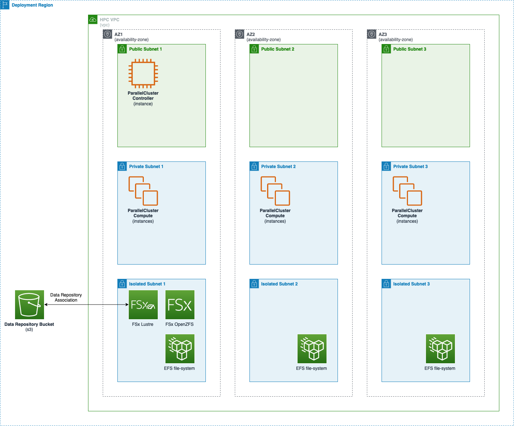

# ParallelCluster in CDK

Example deployment using the CFn custom resource functionality added to ParallelCluster in version 3.6.0.

### Setup

1. Clone the repository
2. Update the `local.env` file to include the account/region you wish to deploy to, and the app config file you want to target for deployment
3. Run `source local.env` to make account/region environment variables available to CDK
4. Follow the [official CDK documentation](https://docs.aws.amazon.com/cdk/v2/guide/bootstrapping.html) to make the target account/region ready for CDK deployment (`cdk bootstrap`)
5. Update the config file (`config.json` by default) to reflect changes to the configuration you would like to make
7. Deploy the cluster and its supporting infrastructure (VPC, storage etc) with `cdk deploy`
8. Verify that the cluster is accessible via SSH/SSM, and that mount points are working correctly
9. When finished, remove the cluster and its supporting infrastructure using `cdk destroy`

### Architecture

